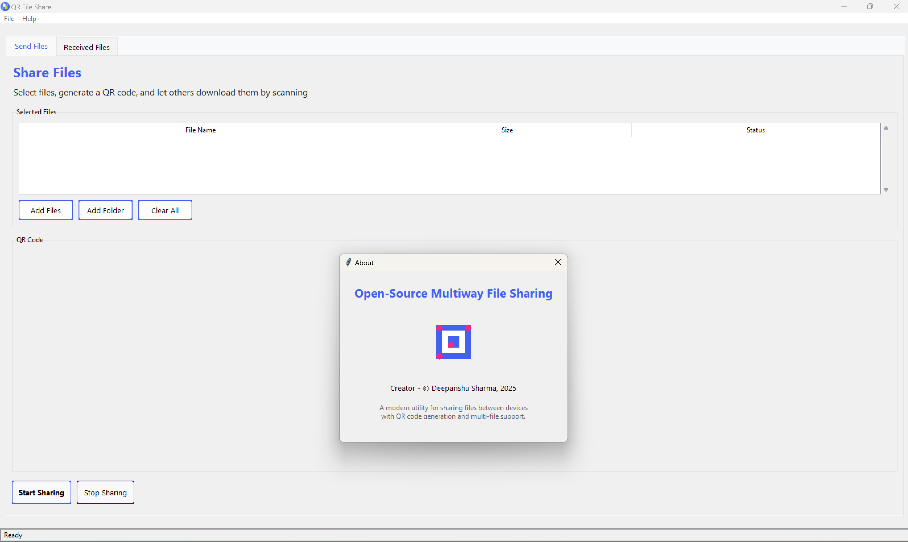

# QR File Share

A modern, open-source utility for quickly sharing files between devices using QR codes. Easily transfer files across devices without the need for cloud services, accounts, or complicated setup.



## ✨ Features

- **Multi-File Sharing**: Select and share multiple files simultaneously
- **Two-Way File Transfer**: Upload files to the host from any device
- **QR Code Generation**: Instant QR codes for easy connection
- **No Internet Required**: Works on local Wi-Fi networks
- **No Size Limits**: Share files up to 100GB
- **Modern Interface**: Clean, intuitive UI with file type icons
- **Cross-Platform**: Works on Windows, macOS, and Linux
- **Zero Configuration**: No setup, accounts, or cloud services needed

## 📷 Screenshots

*[Add screenshots of your application here]*

## 🚀 Getting Started

### Installation

#### Windows
1. Download the latest release from the [Releases](https://github.com/yourusername/qr-file-share/releases) page
2. Run the installer or extract the zip file
3. Launch `QR File Share.exe`

#### macOS and Linux
1. Make sure Python 3.6+ is installed
2. Install the required packages:
   ```
   pip install qrcode[pil] pillow tk
   ```
3. Download the source code
4. Run `python qr-file-share-enhanced.py`

### Building from Source

To build the executable from source:

1. Clone the repository:
   ```
   git clone https://github.com/yourusername/qr-file-share.git
   cd qr-file-share
   ```

2. Install required packages:
   ```
   pip install qrcode[pil] pillow tk pyinstaller
   ```

3. Build with PyInstaller:
   ```
   pyinstaller --onefile --windowed --icon=icon.ico --name="QR File Share" --add-data="icon.ico;." --clean qr-file-share-enhanced.py
   ```

4. The executable will be created in the `dist` folder

## 📖 How to Use

### Sending Files
1. Launch QR File Share
2. Click "Add Files" or "Add Folder" to select files to share
3. Click "Start Sharing" to generate a QR code
4. Have recipients scan the QR code with their device's camera

### Receiving Files
1. Scan a QR code from a sharing device
2. Your browser will open showing available files
3. Click "Download" to save the desired files

### Receiving Uploads
1. When others share files with you, they'll appear in the "Received Files" tab
2. Files are saved to your "QR_File_Share_Received" folder in your home directory
3. Right-click on received files for additional options

## 🔧 Technical Details

- **Local Server**: Creates a temporary HTTP server on your local network
- **Dynamic QR Code**: Contains the server's IP address and port
- **No Data Collection**: All transfers stay on your local network
- **Automatic Port Finding**: Automatically selects an available port
- **Network Discovery**: Works across devices on the same network

## 📜 License

This project is licensed under the MIT License - see the [LICENSE](LICENSE) file for details.

## 👏 Credits

- **Creator**: © Deepanshu Sharma, 2025
- **Icons**: Included file type icons are from various open source projects
- **QR Code Generation**: Uses the [python-qrcode](https://github.com/lincolnloop/python-qrcode) library

## 🤝 Contributing

Contributions are welcome! Please feel free to submit a Pull Request.

1. Fork the repository
2. Create your feature branch (`git checkout -b feature/amazing-feature`)
3. Commit your changes (`git commit -m 'Add some amazing feature'`)
4. Push to the branch (`git push origin feature/amazing-feature`)
5. Open a Pull Request

## 📝 Todo / Future Improvements

- [ ] Password protection for sensitive files
- [ ] File expiry (time-limited sharing)
- [ ] Dark mode
- [ ] Mobile companion app
- [ ] Transfer statistics and history
- [ ] UPnP support for internet sharing
